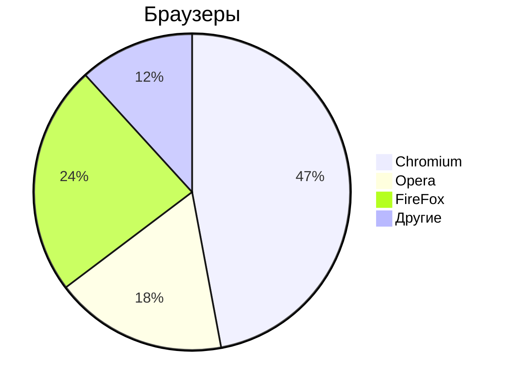

# Markdown
 
- [Основы редактирования текста](/content/Text.md)
 
## Заголовки
 
# - Заголовок 1-го уровня
## - Заголовок 2-го уровня
### - Заголовок 3-го уровня
#### - Заголовок 4-го уровня
 
### Текст
 
- **Жирный текст**
- *Курсив*
- ~~Зачёркнутый текст~~
- <u>Подчёркнутый текст</u>
 
### Горизонтальные линии
 
---
 
***
 
### Списки
 
#### Ненумерованный
 
- Пункт 1
- Пункт 2
 
* Пункт 1
* Пункт 2
    - Пункт 1
    - Пункт 2
 
#### Нумерованный список
 
1. Пункт 1
1. Пункт 2
1. Пункт 3
1. Пункт 4
1. Пункт 5
1. Пункт 6
 
### Ссылки
 
#### Внутренние ссылки
 
[Текст ссылки](/content/Mermaid/README.md)
 
### Якоря по документу
 
- [Редактирование текста](#text-editor)
 
### Внешние ссылки
 
- [ОЗОН](https://ozon.ru)
 
### Изображения
 

 
### Код
 
`Ctrl+R` - обновить страницу браузера
`F5`     - обновить страницу браузера
 
```python
print('Hello');
```
```cpp
int main() {
    pust("Hello");
}
```
 
### Mermaid
 

 
### Цитаты
 
> Тут важный текст
> Цитата 1
> Цитата 2
 
### Таблицы
 
| Заголовок 1 | Заголовок 2 | Заголовок 3 |
|-------------|-------------|-------------|
| Ячейка 1    | Ячекйка 2   | Ячейка 3    |
| Ячейка 4    | Ячекйка 5   | Ячейка 6    |
|             |             |             |
 
### Список задач
 
- [х] Закрытая задача
- [ ] Открытая задача
 
***
## Основы редактирования текста
 
### Курсор
 
Клавиши и клавиатурные сокращения
 
- `Home` - курсор в начало строки
- `END`  - курсор в конец строки
- `pgUP` - курсор вверх видимой части документа
- `pgDOWN` - курсор вниз видимой части документа
- `Del`/`Delete` - удаление символа справа от курсора
- `Backspace` - удаление символа слева от курсора
- `^`/`v` - перемещение курсора вверх и вниз
- `<`/`>` - перемещение курсора влево и вправо
- `Ctrl+>`/`Ctrl+<` - перемещение Update Bash/READMкурсора вправо и влево по словам
- `Ins`/`Insert` - режим замены, замещает старый текст новым справа от курсора
- `Tab` - отсуп на 2 или 4 пробела
- `Esc` - отмена текущего режима
 
### Текст
 
#### Редактирование
 
- `CapsLock` - все строчные буквы (верхний регистр)
 
#### Выделения
 
- `Ctrl+A`  - выделить весь текст
- `Shift+>` - посимвольное выделение вправо
- `Shift+<` - посимвольное выделение влево
- `Ctrl+Shift+>` - пословное выделение вправо
- `Ctrl+Shift+<` - пословное выделение вправо
- `Ctrl+C` - копирование выделенного
- `Ctrl+V` - вставка скопированного
    - `Ctrl+Shift+C` - копирование выделенного в терминале
    - `Ctrl+Shift+V` - вставка скопированного в терминале
- `Ctrl+X` - вырезать выделенное
 
#### Сохранение и отмена
 
- `Ctrl+S` - сохранить текущий документ
- `Ctrl+Z` - отменить изменение
- `Ctrl+Y` - к последнему изменению (отмена отмены)
 
#### Поиск по документу
 
- `Ctrl+F`/`F3` - поиск
- `Ctrl+H` - поиск с заменой